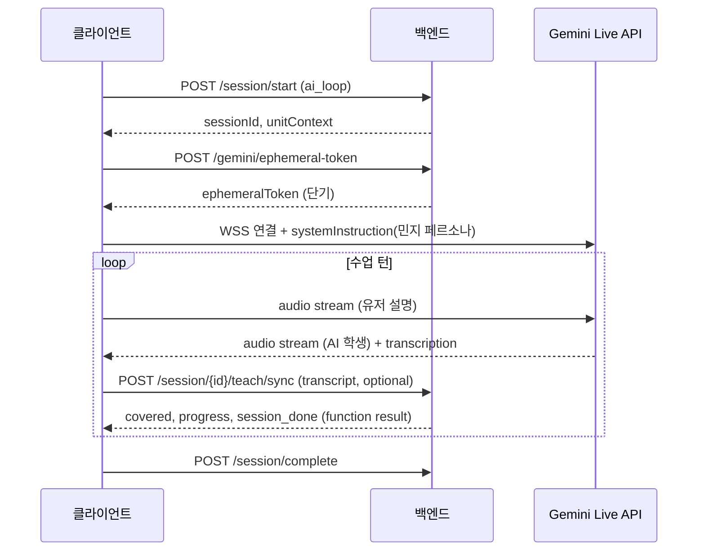
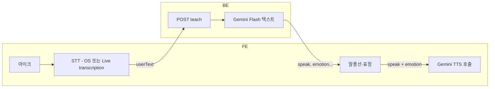

# AI 대화 루프 구현 — 방향 B: Gemini Voice API 활용

| 항목 | 내용 |
| --- | --- |
| 버전 | v0.1 · 팀 검토용 |
| 기준 설계서 | [ai-conversation-loop-system-design.pdf](../reference/architecture/ai-conversation-loop-system-design.pdf) |
| 연관 명세 | [개발자 기능 명세서](../reference/product/developer-feature-spec.html), [API·DB 모델링 계획](api-and-database-modeling-plan.md) |
| 대안 문서 | [teach-text-only-implementation.md](teach-text-only-implementation.md) |
| 대상 | 백엔드 · 프론트엔드 |
| 핵심 원칙 | **Google Gemini 음성 스택(Live API · TTS API)으로 유저 음성 입력·AI 음성 출력을 처리한다.** |

---

## 1. 방향 요약

Google Gemini는 음성 관련으로 **두 가지 API**를 제공한다. 본 문서는 둘 다 다루고, 팀이 선택할 **하위 방향 B-1 / B-2**를 제시한다.

| 하위 방향 | API | 특징 | 설계서 JSON(`covered`, `emotion` 등) 부합 |
| --- | --- | --- | --- |
| **B-1 Live API** | [Gemini Live API](https://ai.google.dev/gemini-api/docs/live-api) | WebSocket 실시간 음성 대화, barge-in, 감정 톤 | **추가 설계 필요** (Function calling) |
| **B-2 Text LLM + Gemini TTS** | 텍스트 `generateContent` + [Gemini TTS](https://ai.google.dev/gemini-api/docs/speech-generation) | 턴 단위: LLM JSON → `speak` → TTS 오디오 | **높음** — 방향 A와 동일 계약 + TTS만 Gemini |

> **권장:** 설계서의 구조화 JSON·정정 사다리·진행도를 그대로 쓰려면 **B-2**가 리스크가 낮다. **B-1**은 몰입감·지연은 우수하나 상태 추적 설계 비용이 크다.

### 1.1 방향 A와의 차이

| | 방향 A (텍스트 BE + 클라 임의 STT/TTS) | 방향 B (Gemini Voice) |
| --- | --- | --- |
| STT | FE가 임의 엔진 | Live API 내장 또는 Gemini 오디오 입력 |
| TTS | FE가 임의 엔진 | Gemini TTS (`gemini-*-tts-preview`) |
| LLM | BE 텍스트 API | B-1: Live 세션 / B-2: BE 텍스트 API (Gemini Flash 등) |
| BE 음성 처리 | 없음 | B-1: 토큰 발급·프록시 가능 / B-2: TTS 호출 선택적 |
| API 키 | LLM만 BE | Gemini 키 — FE(ephemeral) 또는 BE |

---

## 2. Gemini API 개요 (2026 기준)

### 2.1 Live API

| 항목 | 스펙 |
| --- | --- |
| 프로토콜 | Stateful **WebSocket (WSS)** |
| 입력 | Audio 16-bit PCM 16kHz, Image(JPEG ≤1FPS), Text |
| 출력 | Audio 16-bit PCM **24kHz** |
| 부가 | Audio transcription(입·출력 텍스트), barge-in, affective dialog, tool use |
| 연결 | **Client-to-server**(FE 직접) 또는 **Server-to-server**(BE 프록시) |
| 프로덕션 | [Ephemeral tokens](https://ai.google.dev/gemini-api/docs/ephemeral-tokens) 권장 (API 키 FE 노출 방지) |

### 2.2 TTS API (generateContent + AUDIO)

| 항목 | 스펙 |
| --- | --- |
| 모델 | `gemini-2.5-flash-preview-tts`, `gemini-3.1-flash-tts-preview` 등 |
| 입력 | **텍스트 only** |
| 출력 | **오디오 only** (PCM/WAV) |
| 제어 | `voice_name`(30종), 프롬프트·`[whispers]` 등 audio tag, 한국어 자동 감지 |
| 용도 | `speak` 문장을 **정확히** 읽기 — 설계서 1~2문장 말풍선에 적합 |

### 2.3 emotion ↔ Gemini TTS 매핑 (B-2)

설계서 `emotion`을 TTS 프롬프트 prefix로 변환한다.

| emotion | TTS 프롬프트 prefix (예) | voice_name 후보 |
| --- | --- | --- |
| `curious` | `Say curiously, like an elementary student:` | `Leda` (Youthful) |
| `confused` | `Say hesitantly, tilting head:` | `Enceladus` (Breathy) |
| `thoughtful` | `Say slowly, thinking:` | `Umbriel` (Easy-going) |
| `aha` | `Say excitedly, with realization:` | `Puck` (Upbeat) |
| `happy` | `Say cheerfully:` | `Aoede` (Breezy) |

UT 전 [Voice Library](https://aistudio.google.com/generate-speech)에서 아동 톤 A/B 필수.

---

## 3. 하위 방향 B-1: Gemini Live API

### 3.1 아키텍처 (Client-to-server 권장)



### 3.2 핵심 과제 — 구조화 상태와 음성의 분리

Live API는 **자연스러운 음성 대화**에 최적화되어 있고, 설계서가 요구하는 매 턴 JSON(`covered`, `missing`, `correction_stage`…)은 기본 출력에 **포함되지 않는다**.

**해결 패턴 (택 1):**

| 패턴 | 설명 | 복잡도 |
| --- | --- | --- |
| **Function calling** | Live 세션에 `report_turn_state` 도구 정의 — 모델이 매 응답 후 도구 호출로 JSON 상태 전달 | 중 |
| **듀얼 모델** | Live = 음성만, BE Gemini Flash = 유저 transcription → JSON 평가 (teach와 유사) | 중~높음 |
| **Transcript 후처리** | Live 출력 transcription만 BE `teach`로 보내 상태 계산 (음성·상태 불일치 가능) | 낮음, 품질 리스크 |

**권장 (B-1):** Function calling으로 `aiResponse` 스키마를 도구 반환값으로 강제.

```json
{
  "name": "report_turn_state",
  "parameters": {
    "speak": "string",
    "emotion": "curious|confused|thoughtful|aha|happy",
    "covered": ["string"],
    "missing": ["string"],
    "misconceptions_detected": ["string"],
    "correction_stage": 0,
    "focus_concept": "string",
    "session_done": false
  }
}
```

- Live 오디오 출력 = `speak` 내용 (페르소나 일치 검증 필요)
- FE는 function result로 말풍선·표정·진행도 갱신
- BE는 function result를 `conversation_turns`에 저장 (FE가 relay하거나 Live proxy가 수신)

### 3.3 백엔드 역할 (B-1)

| API | 설명 |
| --- | --- |
| `POST /gemini/ephemeral-token` | FE용 단기 토큰 발급 (세션·user 바인딩) |
| `GET /session/{id}/live-config` | `systemInstruction`, `unit_json`, tool 정의, `voice` 설정 |
| `POST /session/{id}/teach/sync` | FE가 Live function result / transcription 전달 → DB 저장·진행도 |
| `POST /session/complete` | 기존과 동일 |

**선택:** BE가 WebSocket 프록시(Server-to-server) — 키 비노출·로깅 용이, 지연·구현 비용 증가.

### 3.4 클라이언트 역할 (B-1)

- 마이크 PCM 16kHz 스트리밍 → Live WSS
- Live 오디오 24kHz 재생 (Web Audio API)
- Barge-in: 유저 발화 시 재생 중단
- Function call 수신 → UI + optional BE sync
- Waveform·표정·진행도 — 설계서 Layer 4 동일

### 3.5 B-1 장단점

| 장점 | 단점 |
| --- | --- |
| 최저 지연·자연스러운 대화 | 구조화 JSON 강제 설계 비용 |
| STT+TTS+LLM 단일 벤더 | WebSocket·PCM FE 구현 난이도 높음 |
| 한국어 70개 언어 지원 | Live + function 품질 UT 필수 |
| Barge-in 네이티브 | 방향 A 대비 디버깅 어려움 |

---

## 4. 하위 방향 B-2: Text LLM (BE) + Gemini TTS (클라이언트 또는 BE)

방향 A의 **텍스트 teach 계약**을 유지하고, TTS만 Gemini로 통일한다.

### 4.1 아키텍처



**STT 선택지**

| 옵션 | 설명 |
| --- | --- |
| FE OS STT | 방향 A와 동일, teach는 텍스트 |
| Gemini multimodal | 짧은 녹음을 `generateContent` audio input으로 전송 — **별도 STT API** |
| Live API transcription only | 과도한 결합, 비권장 |

### 4.2 TTS 호출 위치

| 위치 | 장점 | 단점 |
| --- | --- | --- |
| **FE 직접** | BE 단순, 오디오 BE 경유 없음 | Gemini API 키 → **ephemeral token** 필수 |
| **BE 프록시** | 키 비노출, 캐시 가능 | PCM/Base64 응답 크기, BE 부하 |

**권장 (프로토):** FE + ephemeral token. **캐시 필요 시:** BE 프록시 + `speak` 해시 캐시.

### 4.3 `POST .../gemini/tts` (BE 프록시 시)

**Request**

```json
{
  "speak": "쌤, 분모는 안 바뀌는 거예요?",
  "emotion": "curious",
  "voiceName": "Leda"
}
```

**Response `data`**

```json
{
  "audioBase64": "...",
  "mimeType": "audio/wav",
  "sampleRateHz": 24000,
  "durationMs": 2400,
  "cached": false
}
```

방향 A의 `audioUrl` 대신 **Base64 inline** — Object Storage 불필요. FE가 Blob URL 생성 후 재생.

 teach 응답에는 TTS를 **포함하지 않고**, FE가 `aiResponse` 수신 후 별도 TTS 호출 (지연 분리).

### 4.4 B-2와 방향 A 관계

| 계층 | 방향 A | B-2 |
| --- | --- | --- |
| teach API | 동일 (`userText` → JSON) | 동일 |
| LLM | Claude/GPT 등 | **Gemini Flash** (단일 벤더) |
| TTS | FE 임의 | **Gemini TTS** |
| STT | FE 임의 | FE 임의 (동일) |

→ **BE teach 구현은 방향 A 문서를 그대로 재사용**하고, `LlmClient`만 Gemini로 바꾸면 된다.

### 4.5 B-2 장단점

| 장점 | 단점 |
| --- | --- |
| 설계서 JSON 100% 호환 | 턴당 LLM + TTS 순차 지연 (3~6초) |
| 방향 A 대비 BE diff 최소 | TTS Preview 모델 안정성 모니터링 |
| Gemini TTS 감정·아동 톤 튜닝 용이 | STT는 여전히 별도 |
| Function calling 불필요 | Live 대비 대화 “끊김” 체감 |

---

## 5. 공통 — 백엔드 API (B-1·B-2)

### 5.1 Ephemeral Token 발급

```
POST /gemini/ephemeral-token
Authorization: Bearer {deviceUserId}

Request:  { "sessionId": "uuid", "purpose": "live" | "tts" }
Response: { "token": "...", "expiresAt": "ISO-8601" }
```

- BE가 Google API로 단기 토큰 생성, `sessionId`·userId 바인딩
- Rate limit: 유저당 일 N회

### 5.2 teach API (B-2 및 B-1 듀얼/후처리 패턴)

[teach-text-only-implementation.md](teach-text-only-implementation.md) §5.2와 **동일 계약**.

B-1 Function calling 패턴에서는 Live가 `speak` 음성을 이미 냈으므로, `teach/sync`는 **상태 저장 전용** (LLM 재호출 없음).

### 5.3 DB

방향 A와 동일 — `conversation_turns`, `curriculum_units`, `conversation_mode`.

추가 (선택):

| 컬럼 | 용도 |
| --- | --- |
| `live_session_id` | B-1 WebSocket 세션 추적 |
| `gemini_model_version` | TTS/Live 모델 버전 로깅 |

---

## 6. 설정

```yaml
gemini:
  api-key: ${GEMINI_API_KEY}
  text-model: gemini-2.5-flash
  tts-model: gemini-2.5-flash-preview-tts
  live-model: gemini-2.5-flash-native-audio-preview  # B-1, 버전 확인 필요
  ephemeral-token-ttl-seconds: 300
  tts-timeout-ms: 3000

conversation:
  max-turns-per-session: 10
```

모델 ID는 [공식 모델 문서](https://ai.google.dev/gemini-api/docs/models) 기준으로 배포 전 확정.

---

## 7. 보안

| 위험 | 대응 |
| --- | --- |
| API 키 FE 노출 | Ephemeral token only, Live/TTS 직접 호출 |
| 토큰 도용 | `sessionId`·userId 바인딩, 짧은 TTL, 1회성 |
| 아동 데이터 | 음성 스트림 로깅 최소화, transcription만 DB (정책 확정) |
| 비용 폭주 | 턴 제한, 일일 세션 제한, 토큰 발급 rate limit |

---

## 8. 구현 로드맵

### B-2 (권장 우선)

| 주차 | BE | FE |
| --- | --- | --- |
| W1 | Gemini Flash 콘솔 — 민지 페르소나·JSON | Voice Library TTS 화자 선정 |
| W2 | `teach` (Gemini text) — 방향 A 재사용 | `speak` → Gemini TTS 재생 |
| W3 | `ephemeral-token` + (선택) `gemini/tts` 프록시 | STT + teach 루프 |
| W4 | 안전장치·로깅 | emotion·사다리 UI |

### B-1 (Live — B-2 검증 후)

| 주차 | BE | FE |
| --- | --- | --- |
| W1 | Function schema·systemInstruction 설계 | AI Studio Live 프로토타입 |
| W2 | ephemeral-token, live-config | WSS + PCM 입출력 |
| W3 | teach/sync, conversation_turns | Function result → UI |
| W4 | (선택) WS 프록시 | Barge-in·몰입 UT |

---

## 9. 비용·지연 (추정)

| 패턴 | 턴당 지연 | 세션당 비용 |
| --- | --- | --- |
| B-2 (text + TTS) | LLM 2~4s + TTS 0.5~1.5s | ~150~300원 |
| B-1 (Live) | 0.5~2s (스트리밍) | Live 요금 정책 확인 필요, UT 규모면 저렴 |

---

## 10. 방향 선택 가이드

| 선택 | 조건 |
| --- | --- |
| **방향 A** ([teach-text-only](teach-text-only-implementation.md)) | BE 최소, STT/TTS 벤더 자유, LLM Claude/GPT 유지 |
| **B-2** | Gemini 단일 벤더, 설계서 JSON 유지, TTS 품질 중시 |
| **B-1** | 실시간 대화·barge-in 최우선, Function calling 설계 감수 |

**실무 권장 순서:** 방향 A 또는 **B-2**로 teach+E2E 완성 → 몰입도 부족 시 **B-1** 파일럿.

---

## 11. Open Questions

| ID | 질문 | 담당 |
| --- | --- | --- |
| G-1 | B-1 vs B-2 최종 선택 | PM + BE + FE |
| G-2 | Live native audio 모델 ID 확정 | BE |
| G-3 | Function calling 시 speak·오디오 일치 검증 방법 | BE + FE |
| G-4 | TTS FE 직접 vs BE 프록시 | BE + Infra |
| G-5 | 아동 음성 transcription 저장·보관 정책 | PM + Legal |
| G-6 | Ephemeral token 발급 API 스펙 (Google 최신) | BE |

---

## 12. 요약

Gemini Voice 방향은 **Live API(B-1)** 와 **Text LLM + Gemini TTS(B-2)** 로 갈린다. 설계서의 구조화 JSON·정정 사다리를 지키려면 **B-2가 구현 가능성이 높고**, **B-1**은 몰입감은 뛰어나나 Function calling·WebSocket 설계가 선행되어야 한다. [teach-text-only-implementation.md](teach-text-only-implementation.md)의 텍스트 teach API는 B-2의 백엔드 골격으로 그대로 쓸 수 있다.

---

*v0.1 · [Gemini Live API](https://ai.google.dev/gemini-api/docs/live-api) · [Gemini TTS](https://ai.google.dev/gemini-api/docs/speech-generation) 기준*