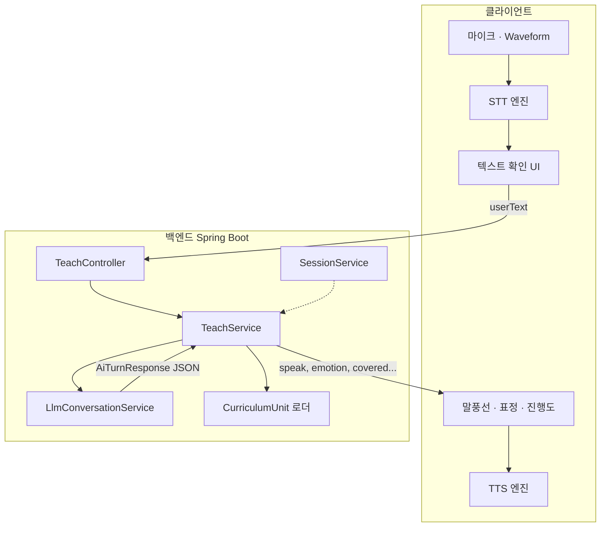

# AI 대화 루프 구현 — 방향 A: 텍스트 전용 백엔드 + 클라이언트 음성

| 항목 | 내용 |
| --- | --- |
| 버전 | v0.1 · 팀 검토용 |
| 기준 설계서 | [ai-conversation-loop-system-design.pdf](../reference/architecture/ai-conversation-loop-system-design.pdf) |
| 연관 명세 | [개발자 기능 명세서](../reference/product/developer-feature-spec.html), [API·DB 모델링 계획](api-and-database-modeling-plan.md) |
| 대안 문서 | [gemini-voice-api-implementation.md](gemini-voice-api-implementation.md) |
| 대상 | 백엔드 · 프론트엔드 |
| 핵심 원칙 | **백엔드는 텍스트만 받고 구조화 JSON 텍스트만 반환한다. STT·TTS·녹음·재생은 전부 클라이언트 책임.** |

---

## 1. 방향 요약

### 1.1 책임 분리

```
┌─────────────────────────────────────────────────────────────┐
│  클라이언트 (Layer 3 + Layer 4 음성·UX)                      │
│  · 마이크 녹음 · STT · TTS · Waveform · 말풍선 · 표정        │
│  · 유저 텍스트 확인·수정 UI                                  │
└──────────────────────────┬──────────────────────────────────┘
                           │  text in  /  JSON out (speak 등)
┌──────────────────────────▼──────────────────────────────────┐
│  백엔드 (Layer 1 + Layer 2)                                  │
│  · 커리큘럼 JSON · 시스템 프롬프트 · LLM 턴 · 세션·진행 상태  │
│  · 음성 바이너리·audioUrl·transcribe API 없음                │
└─────────────────────────────────────────────────────────────┘
```

설계서 4-Layer에서 **Layer 3(음성 입력)을 백엔드가 아닌 FE 소유**로 재정의한다. Layer 2 LLM 출력의 `speak`는 **텍스트**이며, FE가 자체 TTS로 읽어 준다.

### 1.2 이 방향을 선택하는 이유

| 장점 | 설명 |
| --- | --- |
| BE 단순화 | Clova·S3·multipart·오디오 캐시 불필요 |
| 지연 분리 | LLM 2~5초만 BE 병목, TTS는 기기 로컬·병렬 가능 |
| 기존 스택 적합 | Spring Web + JPA만으로 구현 가능 (HTTP 클라이언트 1개 추가) |
| 폴백 자연스러움 | TTS 실패 시 말풍선만 표시 — BE 변경 없음 |
| 키 보안 | STT/TTS API 키를 FE에 둘지(네이티브 SDK) 별도 결정, **BE에 음성 키 불필요** |

| 단점 | 완화 |
| --- | --- |
| FE 구현량 증가 | STT/TTS 라이브러리·상태 머신은 FE 전담 |
| 기기별 음질 편차 | Clova/Android·iOS SDK 또는 Web Speech API + UT |
| 대화 로그에 음성 원본 없음 | 필요 시 FE가 `userText`만 전송 (현재 요구 충족) |

---

## 2. 성공 기준

| # | 기준 | 검증 주체 |
| --- | --- | --- |
| 1 | 유저 발화가 FE STT → 텍스트 확인 → `teach` API로 전달된다 | FE + BE 통합 |
| 2 | BE는 `aiResponse.speak` 등 **설계서 §3.1 JSON**만 반환한다 | BE 단위·통합 테스트 |
| 3 | FE는 `speak`를 말풍선 + 로컬 TTS로 재생한다 | FE UT |
| 4 | `emotion`·`correction_stage`에 따라 FE 표정·TTS 톤이 매핑된다 | 디자인 + FE |
| 5 | 기존 `static` 세션(INTRO→REACTION)과 `ai_loop` 세션이 공존 가능하다 | `conversationMode` 분기 |
| 6 | BE 장애 시 FE는 키보드 입력·로컬 TTS로 수업 지속 가능하다 | FE 폴백 |

---

## 3. 아키텍처

### 3.1 컴포넌트 다이어그램



### 3.2 백엔드에 없는 것 (명시적 비범위)

- `POST .../speech/transcribe`
- `audioUrl`, `tts` 필드, MP3 저장·CDN
- `SttService`, `TtsService`, Object Storage
- multipart 음성 업로드

---

## 4. 클라이언트 음성 처리 (FE 명세)

### 4.1 STT

| 항목 | 권장 |
| --- | --- |
| 역할 | 마이크 오디오 → 한국어 텍스트 |
| 후보 | iOS `SFSpeechRecognizer`, Android `SpeechRecognizer`, Web `webkitSpeechRecognition`, 네이버 Clova **클라이언트 SDK** |
| 출력 | `userText` 문자열 (유저 수정 후 teach 전송) |
| 침묵 종료 | 3초 침묵 시 녹음 종료 (설계서 §5.5) |
| 백업 | 키보드 입력 토글 상시 노출 |

### 4.2 TTS

| 항목 | 권장 |
| --- | --- |
| 입력 | BE 응답 `aiResponse.speak` (1~2문장) |
| 후보 | OS 내장 TTS, Clova Voice **클라이언트**, Web Speech API `speechSynthesis` |
| `emotion` 매핑 | FE 로컬 테이블 — rate·pitch·voiceId (설계서 §5.2 표정과 동기화) |
| 재생 중 | 마이크 비활성, Waveform idle |
| 실패 | 말풍선 전체 즉시 표시 (무음) |

### 4.3 emotion → FE TTS·표정 (예시)

| emotion | 표정 | TTS rate | TTS pitch |
| --- | --- | --- | --- |
| `curious` | 눈 크게 | 1.05 | +2 |
| `confused` | 고개 기울임 | 0.92 | -1 |
| `thoughtful` | 턱에 손 | 0.88 | 0 |
| `aha` | 눈 반짝 | 1.15 | +3 |
| `happy` | 웃는 얼굴 | 1.10 | +2 |

### 4.4 마이크 상태 머신

```
IDLE → [1탭] RECORDING → [2탭/침묵] STT_PROCESSING → CONFIRM → [전송] TEACH_LOADING
  → 응답 수신 → TTS_PLAYING → IDLE
```

| 상태 | BE 호출 |
| --- | --- |
| RECORDING ~ CONFIRM | 없음 |
| TEACH_LOADING | `POST /session/{id}/teach` |
| mount (static 모드) | `GET /session/{id}/lesson` |

---

## 5. 백엔드 API

인증·envelope는 [api-and-database-modeling-plan.md](api-and-database-modeling-plan.md) §3.0과 동일 (`Authorization: Bearer {deviceUserId}`, `ApiResponse`).

### 5.1 API 목록

| Method | Path | 설명 |
| --- | --- | --- |
| `POST` | `/session/{sessionId}/teach` | **핵심** — 유저 텍스트 1턴 → LLM JSON 응답 |
| `GET` | `/session/{sessionId}/teach/status` | 현재 턴·진행도·`sessionDone` |
| `GET` | `/session/{sessionId}/lesson` | 확장 — `conversationMode`, 초기 `speak` (static/ai 공통) |
| `GET` | `/session/{sessionId}/reaction` | static 모드 유지 |
| `POST` | `/session/{sessionId}/advance-phase` | static 모드 유지 |
| `POST` | `/session/complete` | `session_done` 또는 REACTION 종료 시 |

**제거·미구현:** `speech/transcribe`, `audioUrl`, 음성 관련 모든 BE 엔드포인트.

### 5.2 `POST /session/{sessionId}/teach`

**Request**

```json
{
  "userText": "분수는 전체를 똑같이 나눈 거야"
}
```

| 필드 | 타입 | 필수 | 설명 |
| --- | --- | --- | --- |
| `userText` | string | O | FE STT 결과 또는 키보드 입력 (trim, 1~500자) |

**Response `data`**

```json
{
  "turn": 3,
  "userText": "분수는 전체를 똑같이 나눈 거야",
  "aiResponse": {
    "speak": "아하! 그럼 분모는 나눈 개수구나?",
    "emotion": "aha",
    "covered": ["c1"],
    "missing": ["c2", "c3", "c4"],
    "misconceptions_detected": [],
    "correction_stage": 0,
    "focus_concept": "c2",
    "session_done": false
  },
  "progress": {
    "coveredCount": 1,
    "total": 4
  }
}
```

- `sttResult` 필드 **없음** — BE는 이미 `userText`를 받았으므로 echo만 `userText`로 통일.
- `tts` / `audioUrl` 필드 **없음**.

### 5.3 `GET /session/{sessionId}/lesson` 확장

```json
{
  "sessionId": "uuid",
  "conversationMode": "ai_loop",
  "currentPhase": "INTRO",
  "topicLabel": "3. 분수의 개념",
  "question": {
    "speak": "선생님, 분수는 그냥 숫자랑 어떻게 달라요?",
    "emotion": "curious"
  },
  "hintNote": { }
}
```

| `conversationMode` | 동작 |
| --- | --- |
| `static` | 기존 프로토타입 — `advance-phase` → `reaction` → `complete` |
| `ai_loop` | `teach` N턴 — `session_done=true` 시 `complete` 또는 칭찬 화면 |

static 호환: `question.bubbleText` → `question.speak`로 필드명 통일 검토 (또는 둘 다 내려주고 FE가 `speak` 우선).

### 5.4 에러 코드 (추가)

| code | 상황 |
| --- | --- |
| `TEACH_TURN_LIMIT_EXCEEDED` | max_turns 초과 |
| `TEACH_LLM_TIMEOUT` | LLM 5초 타임아웃 → 폴백 speak 포함 200 가능 |
| `TEACH_SESSION_NOT_AI_LOOP` | static 세션에 teach 호출 |
| `TEACH_EMPTY_USER_TEXT` | 빈 문자열 |

---

## 6. LLM 대화 엔진 (백엔드 핵심)

설계서 §3.1·§3.2·§4와 동일. 백엔드만 구현한다.

### 6.1 TeachService 파이프라인

```
userText
  → 세션·턴 검증 (max_turns, ai_loop 모드)
  → LlmConversationService.generateTurn(context, userText)
  → JSON 스키마 검증 + 금지 어휘 필터 (§5.3)
  → conversation_turns 저장
  → session_done이면 세션 상태 갱신
  → TeachTurnResponse (텍스트만)
```

### 6.2 LlmConversationService

| 책임 | 내용 |
| --- | --- |
| 프롬프트 | Layer 1 `unit_json` → 시스템 프롬프트 (설계서 §3.2) |
| 컨텍스트 | 이전 N턴 `userText` + `aiResponse` 요약 |
| 모델 | Claude Sonnet / GPT-4o / Gemini **텍스트** API (팀 선택) |
| 출력 | 반드시 설계서 JSON 스키마만 |
| 폴백 | 파싱 실패 시 `speak: "쌤, 잠깐 헷갈렸어요. 다시 말씀해 주세요"`, `emotion: confused` |

### 6.3 안전장치 (설계서 §5.4)

| 규칙 | BE 구현 |
| --- | --- |
| max_turns 10 | teach 거부 또는 `session_done` 강제 |
| LLM 5초 타임아웃 | 폴백 JSON |
| 동일 focus_concept 3턴 | correction_stage 4 강제 |
| 세션당 LLM 15회 | Rate limit (선택) |
| 금지 어휘 | speak 출력 후처리 필터 |

---

## 7. 데이터베이스

### 7.1 신규

**`conversation_turns`**

| 컬럼 | 타입 | 설명 |
| --- | --- | --- |
| `id` | BIGSERIAL | PK |
| `session_id` | VARCHAR(36) | FK |
| `turn_number` | INT | |
| `user_text` | TEXT | FE에서 받은 텍스트 |
| `ai_response_json` | JSONB | Layer 2 전체 |
| `created_at` | TIMESTAMPTZ | |

**`curriculum_units`**

| 컬럼 | 타입 | 설명 |
| --- | --- | --- |
| `unit_id` | VARCHAR(50) | `frac_add_01` |
| `curriculum_id` | BIGINT | FK |
| `unit_json` | JSONB | 설계서 §3.3 |
| `system_prompt_template` | TEXT | |

### 7.2 변경

**`tutoring_sessions`**

| 컬럼 | 설명 |
| --- | --- |
| `conversation_mode` | `static` \| `ai_loop` |
| `turn_count` | INT DEFAULT 0 |
| `covered_concepts` | JSONB |

**`lesson_questions`**

| 컬럼 | 설명 |
| --- | --- |
| `emotion` | VARCHAR(20) DEFAULT `curious` |

음성 URL·오디오 blob 컬럼 **추가하지 않음**.

---

## 8. 백엔드 패키지 구조

```
org.prography.samsung.backend
├── conversation/
│   ├── controller/TeachController.kt
│   ├── service/
│   │   ├── TeachService.kt
│   │   └── LlmConversationService.kt
│   ├── client/LlmClient.kt          # 텍스트 API only
│   ├── dto/TeachDtos.kt
│   ├── entity/ConversationTurn.kt
│   └── repository/ConversationTurnRepository.kt
└── session/                         # 기존 — mode·complete 연동
```

---

## 9. 설정

```yaml
conversation:
  llm:
    provider: anthropic   # or openai, google
    model: claude-sonnet-4-20250514
    timeout-ms: 5000
    max-turns-per-session: 10
```

시크릿: `LLM_API_KEY` only (음성 API 키 없음).

---

## 10. static ↔ ai_loop 이행

| 단계 | BE | FE |
| --- | --- | --- |
| **P6** | `lesson`에 `speak`+`emotion`, static 유지 | 정적 `speak` 로컬 TTS 재생 |
| **P7** | `teach` + `ai_loop` + `conversation_turns` | STT→teach→TTS 루프 |
| **P8** | `session_done` → `complete` 연동 | 진행도·사다리 UI |

**TQ-4 (제품):** `ai_loop`가 `advance-phase`를 대체하는 시점 — PM 확정 전까지 `conversation_mode`로 분기.

---

## 11. 구현 로드맵 (BE 중심)

| 주차 | 산출물 |
| --- | --- |
| W1 | Layer 1 단원 JSON 1개 + LLM 콘솔 텍스트 검증 |
| W2 | `TeachService` + `POST teach` + Flyway |
| W3 | `ai_loop` 세션 시작·`teach/status`·안전장치 |
| W4 | FE 연동 지원 (에러 코드·OpenAPI 정리) |

FE STT/TTS는 W2부터 병렬 가능 (BE mock `speak`로 TTS만 먼저 검증).

---

## 12. 테스트

| 레벨 | 내용 |
| --- | --- |
| 단위 | JSON 스키마 검증, 금지 어휘, max_turns |
| 통합 | `POST teach` — WireMock LLM, H2 |
| E2E | 기존 `SessionApiIntegrationTest` + `ai_loop` teach 플로우 |
| 수동 | FE STT 정확도·TTS 감정 UT (BE 무관) |

---

## 13. 비용·지연

| 항목 | BE | FE |
| --- | --- | --- |
| 턴당 지연 | LLM 2~5초 | STT 0.5~2초 + TTS 0.3~1초 (병렬 가능) |
| 턴당 비용 | LLM ~100~200원 | STT/TTS — 기기 내장 시 $0, 클라우드 SDK 시 별도 |

BE 비용은 설계서 LLM 항목만 해당.

---

## 14. Open Questions

| ID | 질문 | 담당 |
| --- | --- | --- |
| A-1 | FE STT — OS 내장 vs Clova 클라이언트 SDK | FE |
| A-2 | `bubbleText` → `speak` 필드 통일 시점 | BE + FE |
| A-3 | LLM 제공자 (Claude vs GPT vs Gemini text) | BE |
| A-4 | `ai_loop` 기본 활성화 시점 | PM |
| A-5 | teach 실패 시 FE 재시도·오프라인 카피 | FE |

---

## 15. 요약

**백엔드는 텍스트 대화 API에 집중한다.** 유저 음성은 FE가 STT로 텍스트화하고, AI 학생 목소리는 FE가 `speak`를 TTS로 읽는다. BE는 설계서의 Layer 2(JSON·정정 사다리·진행 상태)만 담당하며, 음성 인프라·저장소·multipart는 의도적으로 제외한다.

---

*v0.1 · 방향 A — [gemini-voice-api-implementation.md](gemini-voice-api-implementation.md)와 비교 검토*